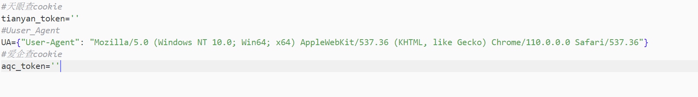

# Domain_Eyes

企业资产收集

optional arguments:
  -h, --help            show this help message and exit
  --name NAME, -n NAME    企业名称
  --deep DEEP, -d DEEP        企业递归层数(默认两层)
  --percent PERCENT, -p PERCENT  占股百分比(默认50)

```
Usage:
python Domain_Eyes.py -n 百度
python Domain_Eyes.py -n 百度 -p 50 -d 3
```

注意：

运行前请修改lib/config.py 中的配置



